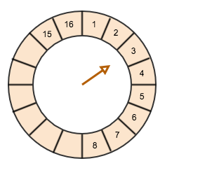

# hashed-wheel-timer


Hashed wheel timer based on [ifesdjeen hashed-wheel-timer](https://github.com/ifesdjeen/hashed-wheel-timer) with
higher time-resolution. This timer can get approximately 50 µs to 100 µs times (with some caveats).

These updates were done mainly to support signal propagation delays in my spiking neural networks, which need µs 
resolution, but can tolerate noise in the delay times.

Benchmarks and example code can be found in the [benchmark repository](https://github.com/robphilipp/hashed-wheel-timer-benchmarks).

## using the timer

The hash-wheel-timer JAR can be found in the maven central with coordinates (for gradle builds)
```groovy
compile 'com.digitalcipher:hashed-wheel-timer:0.0.3'
```

Use the `HashedWheelTimer.Builder` To construct a timer instance
```java
final HashedWheelTimer timer = HashedWheelTimer.builder()
        .withTimerName("my-timer")
        .withResolution(200L, TimeUnit.MICROSECONDS)
        .withWheelSize(512)
        .withWaitStrategy(WaitStrategies.yieldingWait())
        .withDefaultExecutor()
        .build();
```
and then start the timer.
```java
timer.start();
```

Share the timer among threads as you like, or make it a singleton.

Then schedule tasks. In the code example below, we schedule a task, and then block until the
tasks is executed. The task, in this case, is to simply return the nanoseconds from epoch at
the time of execution. So the `executedTime` will hold the time at which the task was executed.
 
```java
final CompletableFuture<Long> future = timer.schedule(System::nanoTime, 200, TimeUnit.MICROSECONDS);
final long executedTime = future.get();
```

When you're done, shut the timer down.

```java
timer.shutdown()
```

### scheduler types
The above example schedules a one-shot delay. That is, the tasks is executed only once after the 
specified delay. In this case, after 200 µs. There are two categories of schedules: single execution,
and periodic execution. Within these categories, there are three schedules:

1.  **one-shot** - (single execution) Executes the task once, after the specified delay 
2.  **fixed-delay** - (periodic execution) Executes the task periodically, starting after the initial delay, and then
    after the task is executed, delays specified time and executes again. Because the delay is 
    calculated after the task has executed, there is always the same delay between when the previous
    task completed and the next tasks is started.
3.  **fixed-rate** - (periodic execution) Executes the task periodically, starting after the initial delay, and then
    after the task is started. Attempts to execute tasks on a fixed period.

As an example, the code snippet below shows a fixed-rate schedule that runs for 1 second, and 
adds the actual delay time to an array starting after an initial delay of 400 µs, and then 
repeating every 200 µs until 1 second has passed.

```java
final List<Long> executionTimes = new ArrayList<>();
final AtomicLong start = new AtomicLong(System.nanoTime());
final CompletableFuture<List<Long>> future = timer.scheduleAtFixedRate(() -> {
    final long execTime = System.nanoTime();
    final long oldStart = start.getAndSet(execTime);
    executionTimes.add(execTime - oldStart);
    return executionTimes;
}, 1L, TimeUnit.SECONDS, 400L, 200L, TimeUnit.MICROSECONDS);
final List<Long> delayTimes = future.get();
```

The `future.get()` call blocks, and returns the list of delay times (which is the same as the
`executionTimes` list). (Taken from the [benchmark code](https://github.com/robphilipp/hashed-wheel-timer-benchmarks/blob/master/src/main/java/com/piggy/spiked/timing/benchmarks/FixedDelayTimerAccuracy.java).)

### hashed-wheel-timer basics
A hashed-wheel timer works by scheduling tasks into slots that represent a specific delay. Consider
the hashed-wheel below.



It has 16 buckets, which is equivalent to saying that it has a wheel-size of 16. The arrow in the center
is the cursor, which represents the current time. As time advances, the cursor advances as well. The
amount of tine represented by each bucket is specified by the timer's resolution parameter. For example,
if in this case the resolution is 1 second, then each bucket in the diagram represents 1 second, and the
cursor advances 1 second at a time. In this case, it would take 16 seconds for the cursor to make one
complete revolution.

When the cursor points to a specific bucket, all the tasks in that bucket are executed.

> As an example, suppose that I want to schedule a task to be executed in about 5 seconds. By placing the 
task into the fifth bucket after the current cursor (bucket 8) would represent at task to be executed 
in 5 seconds.

Advancing the cursor to the next bucket relies on the **wait-strategy**. The hashed-wheel timer
implementation checks periodically to see if the cursor is ready to be advanced. In the most simplistic
approach, a loop runs on a separated thread that checks the current time (in nanoseconds) to see
if it has passed the beginning of the next bucket, in which case it advances the cursor. If the current
time has not advanced past the current bucket, then it checks again. This simplistic approach is the
**busySpin** wait strategy. There are two other strategies as well: **yieldingWait** and **sleepWait**.

### timer parameters
Although the builder provides a decent description of the parameters, there are a few things 
worth mentioning.

#### wheel-size and resolution
The wheel-size and resolution together determine the time it takes to cursor to make one revolution
around the wheel. When delays exceed one revolution, then tasks keep track of how many times 
the cursor has passed them, counting down until they are ready to be executed. 

The resolution determines the accuracy of actual delay of the executed task. For example a resolution of
1 seconds means that a delay of 3.24 seconds will be executed in 3 or 4 seconds, depending on the
time the tasks was scheduled, relative to the amount of tine the cursor is in its current bucket. Although
the resolution is a good approximation to the accuracy for 1 ms resolutions or more, for resolutions
less then 1 ms (i.e. 100 µs) the word "approximate" becomes important.

Generally, a wheel size of 512 is reasonable, but this all depends on your situation.

#### wait strategy
The **busy-spin** strategy is the most accurate because it checks every few hundred nanoseconds (ns), the
amount of time it takes to call `System.nanoTime()`. And, consequently, is the most resource hungry
strategy.

For resolutions of about 100 µs, I have found that the **yielding-wait** strategy to work about as well
as the busy-spin strategy, and use far less resources. This strategy relies on yielding the *wait*
thread, and so the results can be somewhat unpredictable.

The **sleeping-wait** strategy should only be used for resolutions of more than 1 ms. This strategy
relies on sleeping the *wait* thread, and so the results are also somewhat unpredictable.

#### executor
You can pass an executor to the time for it to use to execute the tasks. Alternatively, you can use
the default executor by calling the `withDefaultExecutor()` method, or the `withDefaultExecutor(int numThreads)` 
method on the timer builder.


